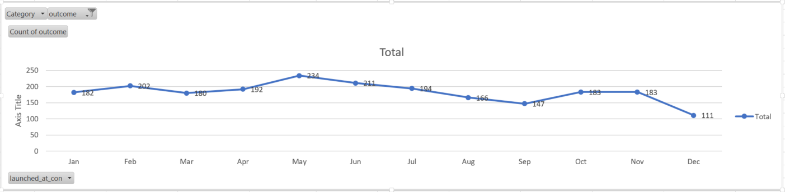

# An Analisys of Kickstarter Campaigns

Performing analysis on Kickstarter data to uncover trends

We performed an analisys based on the data that contains an outcome of 4114 campaigns in US and other countries. According to our findings, 525 theater campaigns from total 912 in the United States were successful.

Regarding subcategory of "Play" in Great Britain, resulting in 238 successful from 314 total number of campaigns, it was the most prosperious.

As shown in the chart below, May is the month of the year when the most accomplished campaigns have started, while the worst time to start a new campaign is December.

Failed Kickstarter campaigns had fundraising goals of 10 th USD, while the average amount of goal for successful campaigns was 5 th USD. The amount of goal of average successful campaign should be an indicator for Louise on how much money to ask.

